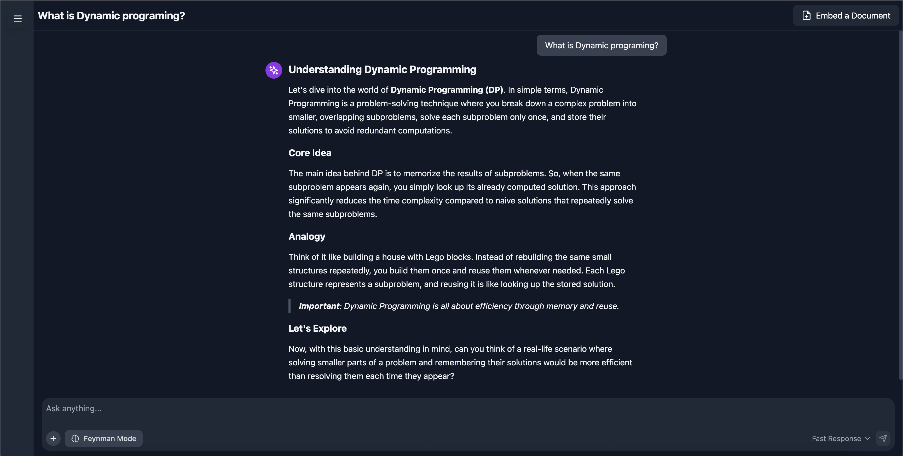

# Learning-Chatbot

A full-stack AI-powered web app that helps students quickly learn new material and deepen their understanding using the **Feynman learning technique**.

🚀 **[Live Demo](https://quicklylearning.com/)**



## Key Features
1. ⚛️ **Fullstack application** with a React frontend and LangGraph backend.
2. 🧱 **Scaffolded Learning** – Explains new concepts by building upon the student’s existing knowledge.
3. 🎓 **Feynman Technique Mentor** – Analyzes student explanations to detect knowledge gaps and provide targeted feedback.
4. 📄 **Automated Transcript Integration** – Fetches lecture transcripts from the University of Michigan for focused study sessions.
5. 🧠 Actively embed the knowledge we have for future reference.

---

 

## Tech Stack
**Frontend:** React, Vite  
**Backend:** FastAPI, Python  
**AI/NLP:** LangGraph, DistilBERT  
**Automation:** Playwright  
**Database:** PostgreSQL, ChromaDB, SQLite checkpointer  
**Infrastructure:** Docker, AWS

---

## Getting Started (Optional)
> If you want to run locally instead of using the live app.

```bash
# Clone repo

cd learning-chatbot

# Backend setup
cd backend
pip install -r requirements.txt
uvicorn app.main:app --reload

# Frontend setup
cd ../frontend
npm install
npm run dev
