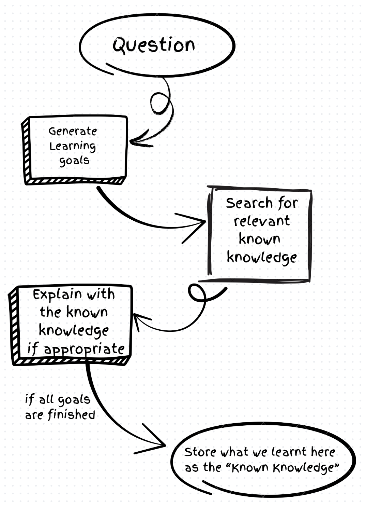
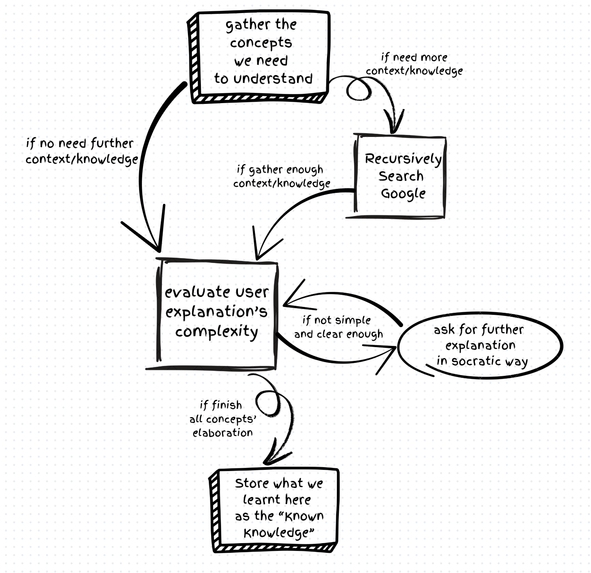

# Learning-Chatbot

A full-stack AI-powered web app that helps students quickly learn new material and deepen their understanding using the **Feynman learning technique**.

🚀 **[Live Demo](https://quicklylearning.com/)**

## Key Features
1. ⚛️ **Fullstack application** with a React frontend and LangGraph backend.
2. 🧱 **Scaffolded Learning** – Explains new concepts by building upon the student’s existing knowledge.
3. 🎓 **Feynman Technique Mentor** – Analyzes student explanations to detect knowledge gaps and provide targeted feedback.
4. 📄 **Automated Transcript Integration** – Fetches lecture transcripts from the University of Michigan for focused study sessions.
5. 🧠 Actively embed the knowledge we have for future reference.
6. ✨ Implements a Propositional Chunking RAG technique to achieve high retrieval accuracy.
7. ⚡ **Dynamic Learning Flow** – Effortlessly switch from absorbing concepts in Learning Mode to explaining them in your own words using Feynman Mode. The transition is instant, with no need to start a new process.

## Tech Stack
**Frontend:** React, Vite  
**Backend:** FastAPI, Python  
**AI/NLP:** LangGraph, DistilBERT  
**Authentication** Google Oauth 2.0 
**Automation:** Playwright  
**Database:** PostgreSQL, ChromaDB, SQLite checkpointer  
**Infrastructure:** Docker, AWS

## Learning agent workflow

## Feynman mode agent workflow

